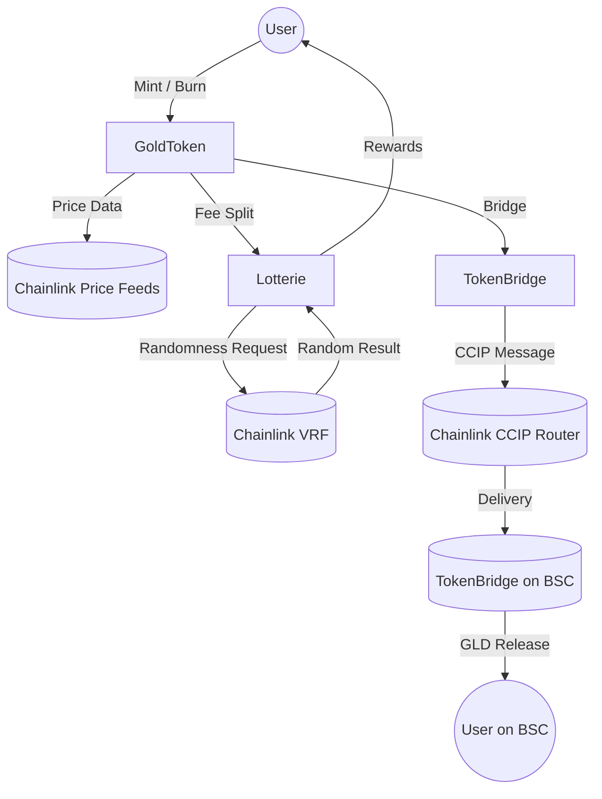

[](https://codecov.io/github/Ronfflex/Golden-bridge)

# Golden Bridge

A gold-backed ERC-20 token where 1 GLD represents 1 gram of gold.  
Users can mint tokens by sending ETH at real-time gold prices using Chainlink Price Feeds.  
A 5% fee applies to mint and burn operations — half is allocated to a verifiably fair on-chain lottery powered by Chainlink VRF.  
The token also supports cross-chain transfers between Ethereum and Binance Smart Chain (BSC) using Chainlink CCIP, ensuring a secure and seamless bridge while the main implementation remains on Ethereum.

## Overview

Golden Bridge demonstrates the integration of multiple advanced smart contract concepts:

- Price oracle usage (Chainlink Price Feed)
- Verifiable randomness (Chainlink VRF)
- Cross-chain communication (Chainlink CCIP)
- On-chain token economics and fee management
- Secure, modular Solidity design following OpenZeppelin standards

This project was built as a personal showcase of Solidity and Web3 development skills, combining real-world token logic with cross-chain interoperability.

## Features

- **Gold-backed tokenomics** — 1 GLD = 1 gram of gold (via Chainlink XAU/USD)
- **Real-time minting and burning** — ETH-to-gold conversion at live prices
- **Fee mechanism (5%)** — 50% to lottery pool, 50% to treasury
- **On-chain lottery** — provably fair draws using Chainlink VRF
- **Cross-chain bridge** — secure message passing via Chainlink CCIP (Ethereum ↔ BSC)
- **Modular architecture** — separated contracts for clarity and reusability

## Architecture



## Tech Stack

**Smart Contracts**

- Solidity 0.8.28 (you can probably downgrade the version a few times)
- OpenZeppelin ERC-20 base contracts
- Chainlink VRF, Price Feed, and CCIP integrations

**Development & Testing**

- Foundry for compilation, deployment, and testing

## Project Structure

```
/src
  ├── GoldToken.sol
  ├── Lotterie.sol
  ├── TokenBridge.sol
  ├── /interfaces
        ├── IGoldToken.sol
        ├── ILotterie.sol
        ├── ITokenBridge.sol
/script
  ├── deployGoldToken.sol
  ├── deployLotterie.s.sol
  ├── deployCoreContracts.s.sol
/test
  ├── GoldToken.t.sol
  ├── Lotterie.t.sol
  ├── TokenBridge.t.sol
  ├── /mock
        ├── TestLinkToken.sol
```

## Smart Contract Logic

**GoldToken.sol**

- Implements ERC-20 standard.
- Uses Chainlink ETH/USD and XAU/USD price feeds for mint/burn calculations.
- Applies 5% fee on mint and burn transactions.
- Distributes fees: 50% to treasury, 50% to Lottery contract.

**Lotterie.sol**

- Integrates Chainlink VRF v2 for verifiable randomness.
- Pulls the GoldToken user list to determine eligible lottery participants.
- Pays the winning address in GLD from the Lotterie contract balance.

**TokenBridge.sol**

- Manages CCIP-based cross-chain transfers.
- Locks GLD on the origin chain and releases pre-funded liquidity on the destination chain.
- Handles CCIP message validation, chain/sender whitelists, and replay protection.

## Setup & Deployment

```
# 1. Clone repository
git clone https://github.com/ronfflex/golden-bridge.git
cd Golden-bridge

# 2. Install dependencies
forge install

# 3. Compile contracts
forge build

# 4. Run tests
forge test

# 5. Deploy (example)
forge script script/deployGoldToken.sol --rpc-url $SEPOLIA_RPC --broadcast --verify

```

## Tests & Coverage

[](https://codecov.io/github/Ronfflex/Golden-bridge)

All core features (mint, burn, fee distribution, VRF lottery, CCIP bridging) are covered with Foundry tests.
A coverage report is generated with:

```
forge coverage
```

## Tokenomics

| Action      | Fee | Allocation                 | Description                                         |
| ----------- | --- | -------------------------- | --------------------------------------------------- |
| Mint / Burn | 5%  | 50% Lotterie, 50% Treasury | Fuels daily lottery rewards and protocol operations |

## Security Considerations

- Uses Chainlink for trusted off-chain data (no centralized oracles)

- Access control and reentrancy protection via OpenZeppelin modifiers

- Strict validation on bridge transfers and lottery draws

- Tested with edge cases and mocked Chainlink responses

## Future Improvements

- Implement a frontend dashboard for minting and lottery participation

- Add fuzz tests for enhanced security

- Submit for professional security audit

## License

MIT License © 2025 - [@Vincent Rainaud](https://github.com/Ronfflex) - [@Coralie Boyer](https://github.com/coralieBo)

## Acknowledgements

- Chainlink
for oracles, VRF, and CCIP

- OpenZeppelin
for ERC-20 and security patterns

- Foundry
for Solidity development and testing tools
